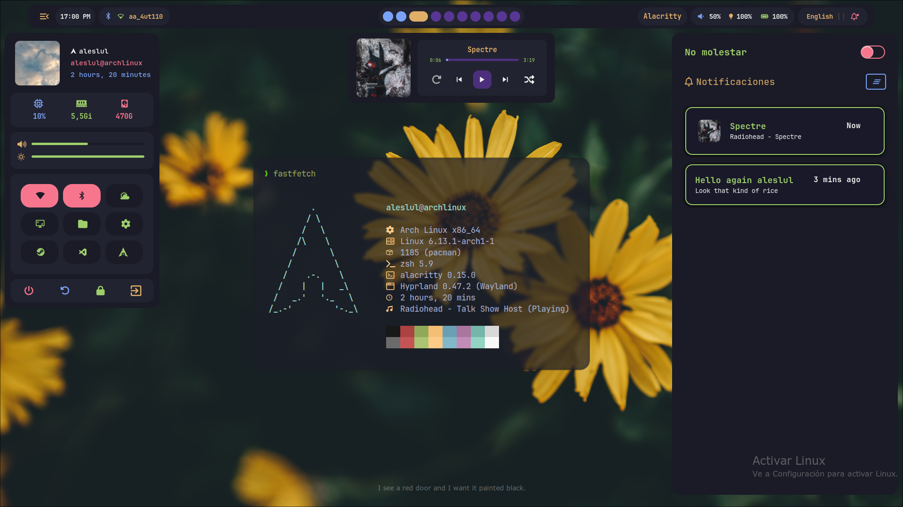
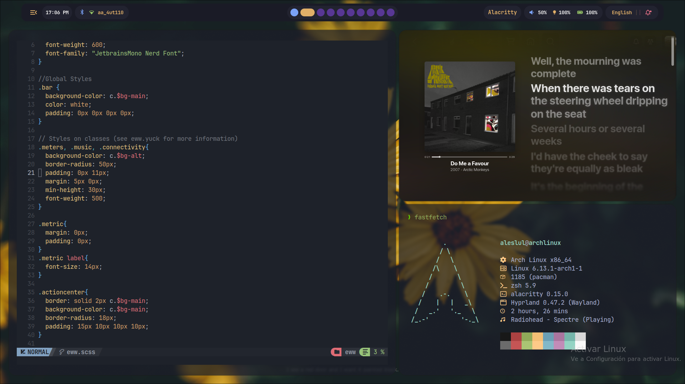
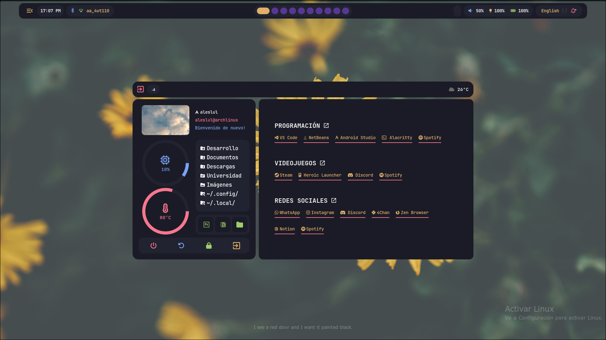
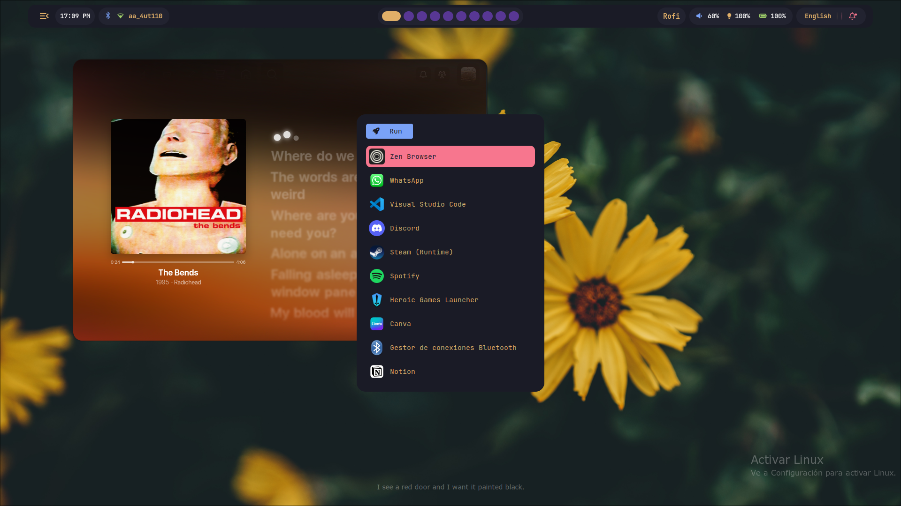

<h1 aling="center">Aleslul's Dotfiles</h1>

Hello there! Those are my dotfiles for Hyprland, enjoy it

<samp>
  
    <b>
    <i>Do you want to thank me? Check this:</i>
     
    <a href="https://open.spotify.com/playlist/5vgUutS4fmKcf00DOi6ERP?si=c5ddccee970b4bac">🎵 Spotify</a> |
    <a href="https://paypal.me/aleslul">💸 PayPal</a>
  
</samp>

> [!CAUTION]
> This rice is for [Hyprland](https://github.com/hyprwm/Hyprland). Don't use it if you're don't know what are you doing

## Dependencies
- eww > For widgets
- swaync > For notifications
- rofi > The application launcher
- waybar > The status bar
- alacritty > The terminal
- zsh > for the terminal
- fastfetch
- hyprlock
- hypridle
- hyprpaper

## Screenshots

## Installation

Nope, don't be lazy, configure it yourself. (I'll be working on an installation file soon)

